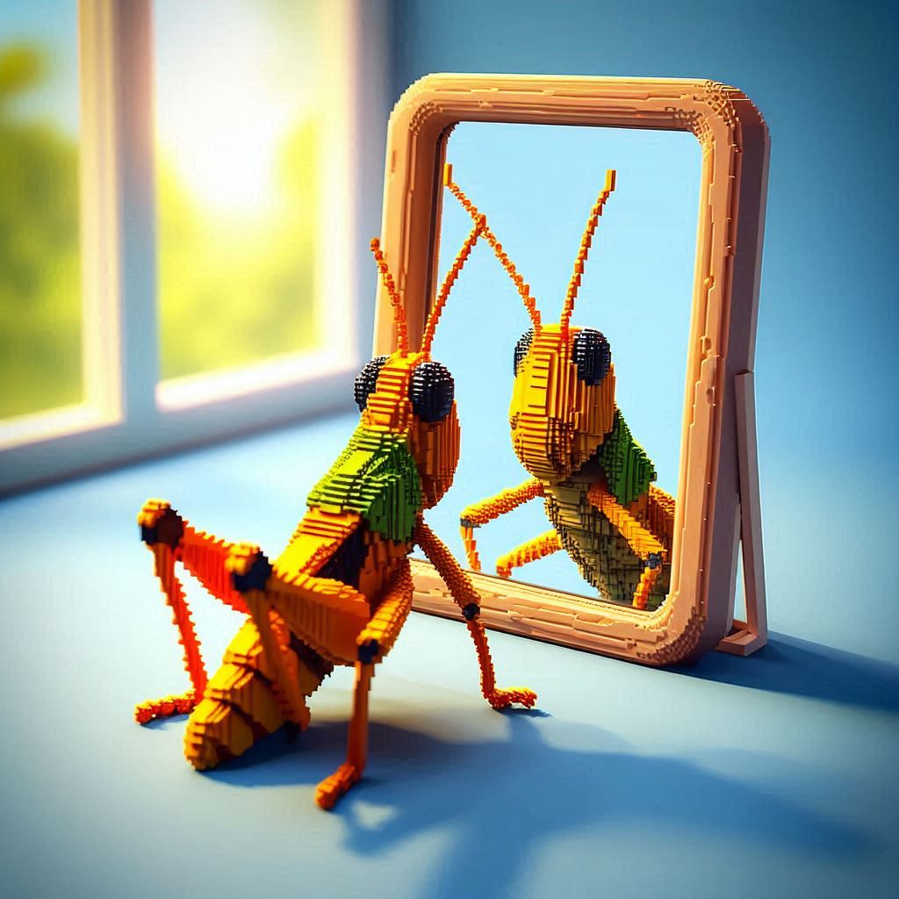

# Grasshopper Mirror 🦗

It's a toss up between Revit and Grasshopper, as the piece of software that's had the biggest impact on the way we draw buildings, in the last 20 or so years. Almost everyone hates using Revit, and really likes using Grasshopper, so let's give the 🥇 prize to Grasshopper. That said, because it's a binary file format, there's no easy way to version control your files. What changed between this version and last week? There's no way to know.

This is an attempt to make a workflow that starts to be a bit more version controllable. It's not going to be as good as we have it with text diffs on code, but it's going in the right direction.

|The graphviz rendering of the DOT file that Mirror produces| The Grasshopper canvas that is being mirrored|
|--|--|
|||

Mirror recreates the Grasshopper graph topology in [DOT Language](https://graphviz.org/doc/info/lang.html). It's automagically laid out with [Graphviz](https://graphviz.org/).

