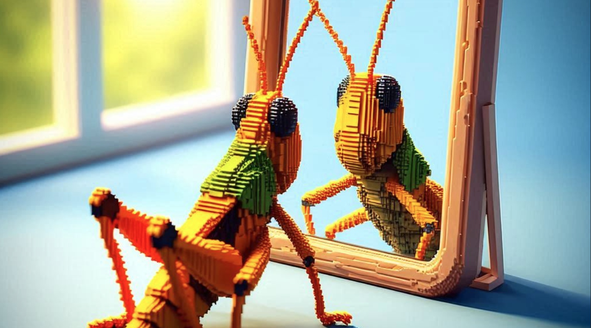
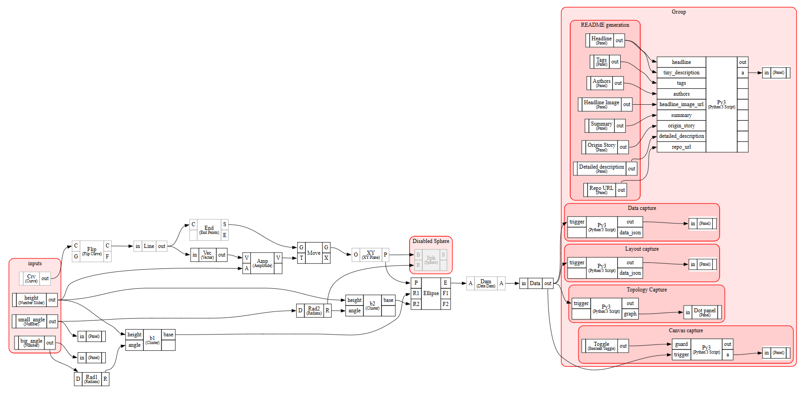
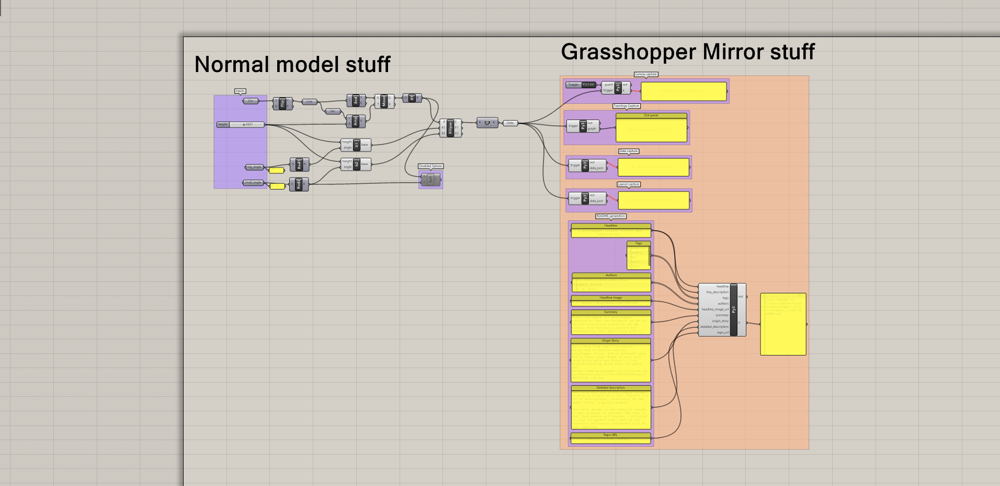
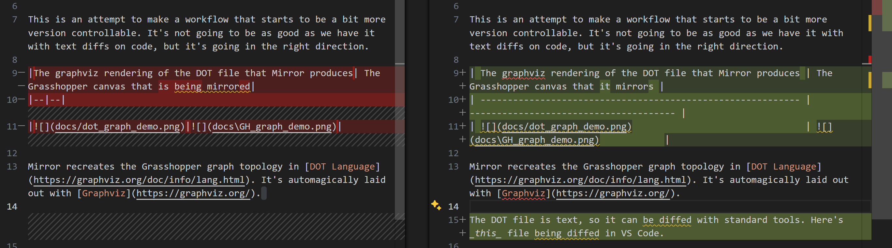

# Grasshopper Mirror 🦗

|                                                                                                                                                                      |                                                                                                                             |
| -------------------------------------------------------------------------------------------------------------------------------------------------------------------- | --------------------------------------------------------------------------------------------------------------------------- |
|  | ⚠ **Early stage code** ⚠ It won't break your Grasshopper, but it's still evolving. |

It's a toss up between Revit and Grasshopper, as the piece of software that's had the biggest impact on the way we draw buildings, in the last 20 or so years. Almost everyone hates using Revit, and really likes using Grasshopper, so let's give the 🥇 prize to Grasshopper. That said, because it's a binary file format, there's no easy way to version control your files. What changed between this version and last week? There's no way to know.

This is an attempt to make a workflow that starts to be a bit more version controllable. It's not going to be as good as we have it with text diffs on code, but it's going in the right direction. It turns out that [I've been thinking about this problem since 2013!](https://www.grasshopper3d.com/forum/topics/version-control?id=2985220%3ATopic%3A831264)

| The graphviz rendering of the DOT file that Mirror produces                            | The Grasshopper canvas that it mirrors                                                |
| -------------------------------------------------------------------------------------- | ------------------------------------------------------------------------------------- |
|      |  |

Mirror recreates the Grasshopper graph topology in [DOT Language](https://graphviz.org/doc/info/lang.html). It's automagically laid out with [Graphviz](https://graphviz.org/). You can play with graphviz [here](https://dreampuf.github.io/GraphvizOnline) and you can also use this to look at the dot files that this system produces.

The DOT file is text, so it can be diffed with standard tools. Here's _this_ file being diffed in VS Code.



You can see where things have been added, taken away and changed. So you can get a sense of what has changed between different versions.

## How to try it out

### Quick start (existing example)

Open `example_folder/test_file.gh` in Rhino 8+. The Mirror nodes are already wired up — trigger the Data Dam and each capture node will run, producing topology DOT, data JSON, layout JSON, a canvas screenshot, and a README.

### Setting up a new project

1. **Create your project folder** with a `.gh` file inside it.
2. **Paste the scaffold wrapper** from [`mirror_scaffold_wrapper.py`](mirror_scaffold_wrapper.py) into a Python 3 Script node and run it once. It will create all the Mirror capture nodes to the right of the scaffold node.
3. **Trigger the Data Dam** to run all captures.

The scaffold creates:

- **Data Dam → Relay** — manual trigger (like a git commit button)
- **Topology Capture** — generates `<name>_topology.dot` (the primary diffable artefact)
- **Layout Capture** — generates `<name>_layout.json` (canvas positions, separate so tidying doesn't pollute diffs)
- **Data Capture** — generates `<name>_data.json` (leaf-node values, script source)
- **Canvas Capture** — screenshots the GH canvas to `canvas_image.png`
- **README Generation** — builds a `README.md` with YAML frontmatter from input panels

### Repo structure

```
your_project/
├── your_file.gh                   # the Grasshopper binary (source of truth)
├── your_file_topology.dot         # graph structure — primary diff target
├── your_file_data.json            # values, script source
├── your_file_layout.json          # canvas positions
├── canvas_image.png               # GH canvas screenshot
├── README.md                      # auto-generated with YAML frontmatter
└── docs/                          # additional images
```

All logic lives in `lib/` at the repo root. Each capture node is a thin wrapper (~15 lines) that imports from `lib/` and calls a single function. The wrappers use `importlib.reload()` so edits to `lib/` take effect without restarting Rhino.

### Viewing the DOT output

The DOT file can be pasted into the [Graphviz online editor](https://dreampuf.github.io/GraphvizOnline/), or rendered in VS Code with a Graphviz extension. Because it's plain text, `git diff` shows exactly what changed structurally between commits.

## Current limitations

- Clusters (nested definitions) are represented as opaque nodes — internal structure isn't shown yet (#15)
- Mirror's own nodes appear in the topology — self-exclusion is planned (#17)
- No Rhino viewport screenshot yet (#20)
- Tested primarily with common components — exotic plugins may have edge cases (#9)

## Where to next?

The general idea is that each GH file lives in its own folder with its diffable metadata. These folders get committed to git, giving you meaningful diffs on what was previously an opaque binary.

Long term, these folders will be aggregated into a searchable website — a catalogue of GH definitions where you can search for _carbon calculators_ and find five, and over time they merge into one ring 💍 to rule them all.

See [spec.md](spec.md) for the full design rationale and landscape of existing tools.
