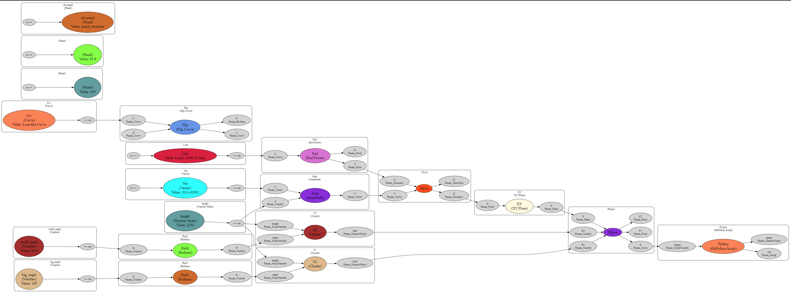

# Grasshopper Mirror 🦗

|                                                                                                                                                                      |                                                                                                                             |
| -------------------------------------------------------------------------------------------------------------------------------------------------------------------- | --------------------------------------------------------------------------------------------------------------------------- |
|  | ⚠ **Warning: Incredibly early stage code!!** ⚠ It won't break your Grasshopper, but it might not work how you expect it to. |

It's a toss up between Revit and Grasshopper, as the piece of software that's had the biggest impact on the way we draw buildings, in the last 20 or so years. Almost everyone hates using Revit, and really likes using Grasshopper, so let's give the 🥇 prize to Grasshopper. That said, because it's a binary file format, there's no easy way to version control your files. What changed between this version and last week? There's no way to know.

This is an attempt to make a workflow that starts to be a bit more version controllable. It's not going to be as good as we have it with text diffs on code, but it's going in the right direction.

| The graphviz rendering of the DOT file that Mirror produces                            | The Grasshopper canvas that it mirrors                                                |
| -------------------------------------------------------------------------------------- | ------------------------------------------------------------------------------------- |
|  |  |

Mirror recreates the Grasshopper graph topology in [DOT Language](https://graphviz.org/doc/info/lang.html). It's automagically laid out with [Graphviz](https://graphviz.org/).

The DOT file is text, so it can be diffed with standard tools. Here's _this_ file being diffed in VS Code.

You can see where things have been added, taken away and changed. So you can get a sense of what has changed between different versions.

## How to try it out:

Copy the code from [`mirror_traverse.py`](mirror_traverse.py) into a python node. It's written for 2.7 ironPython (boo) but should work fine in 3.x pythons.

Rename the output port to "graph" and connect it to a panel. To make things really easy, you can then copy the output and paste it into the [_graphviz online_ editor](https://dreampuf.github.io/GraphvizOnline/).

If you want to get fancier, you can stream the panel to a file, and then set up your VS Code to render the DOT file. (If you want to do that, put up an issue for it and I'll write about it.)

## Caveats

This has a bunch of limitations:

- I've only tested it with the components shown
- I know that it doesn't pick up groups (but it could, I've got a stub for that)
- It's a manual python node so far, so it's not very user friendly
- It needs a trigger, so it probably needs to be wired into the last item in the graph, but there might be a trigger that python can fire?
- The python itself is quite fast (70ms) but streaming to file from a panel can get slow if there's a lot of nodes, or if there's other FS activity
- This is the big one for now, but _is_ surmountable. If a node is purely an output, it's not yet captured. It's drawn on the canvas, but it's not connected. This is because it is only looking at inputs for the moment. Everything has an input, or is an input, except output leaf nodes.

## Where to next?

The next step is to write up a workflow for how to work with this so that it makes your file version controllable with git. [Human UI has a markdown viewer](https://grasshopperdocs.com/components/humanui/createMarkdownViewer.html), which might be interesting.

The general idea is that each file/workflow has a folder. Inside that folder you would have:

- The gh file
- A rhino file that has enough context in it to get the gh file to work
- A markdown file called README.MD
  - because this gets rendered automagically on GitHub. The markdown file would also have:
    - A [front matter](https://docs.github.com/en/contributing/writing-for-github-docs/using-yaml-frontmatter) table that explains what's going on in a machine readable way
- Some nice screenshots
- Instructions on how to get it working
- Context on why it exists and what problem it solves
- Any other files it needs (e.g. a spreadsheet or a text file with coords in it)
- A licence file (this needs to be worked out, which one to pick)

The idea in the long run is that each of these little repos will get aggregated into a website. The website will be for search and presentation, so it will allow you to search for _carbon calculators_, and get 5. Then over time, those 5 will merge into each other, and there will be one ring 💍 to rule them all.

Anyway, that's the idea, if people don't think that this is all totally stupid.
