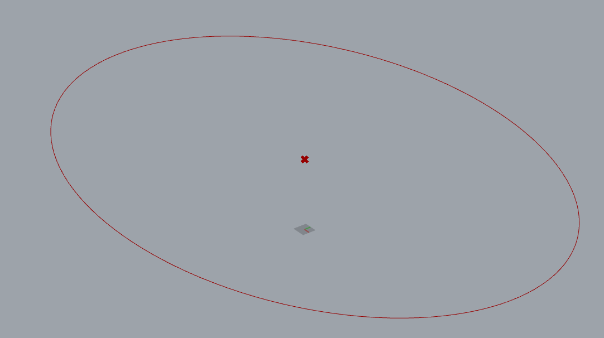
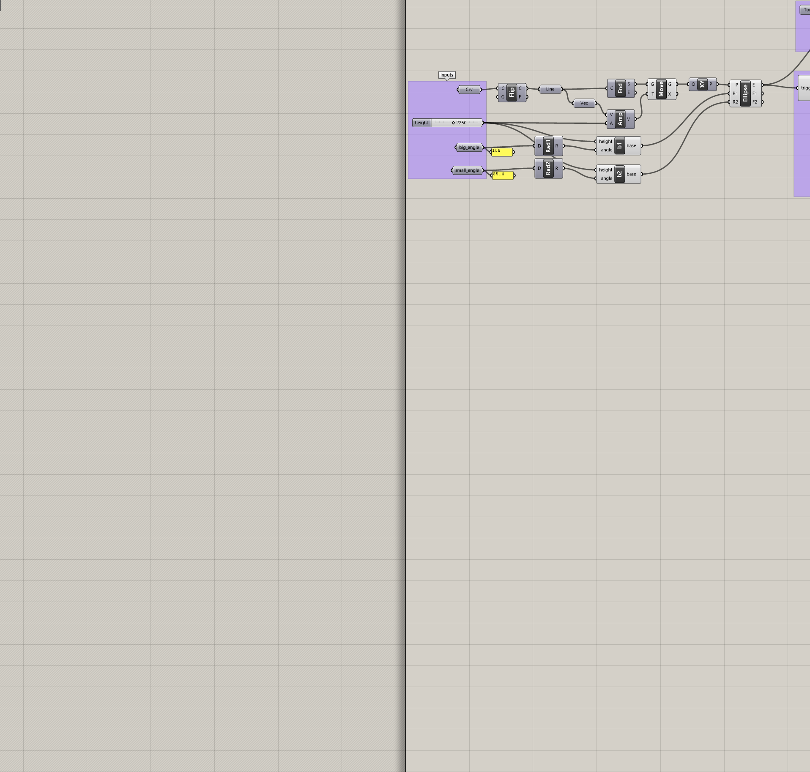

# A grasshopper version control and sharing tool (test_file.gh)

## Summary:

_A **very** short explanation of what this does._

Makes a backpack for grasshopper binaries so that the backpack can be git version controlled alongside the gh binary. Also defines a pattern for documentation that goes along with it.

## Origin story:

_Why did this file come into being?_

For a very long time I've wanted a better way to version control grasshopper files, and to document them, and to share them. Might as well kill three birds with one stone! I first started thinking about this [13 years ago](https://www.grasshopper3d.com/forum/topics/version-control?id=2985220%3ATopic%3A831264) and now

## Detailed description:

_A much longer explanation of what this does._

Todo
