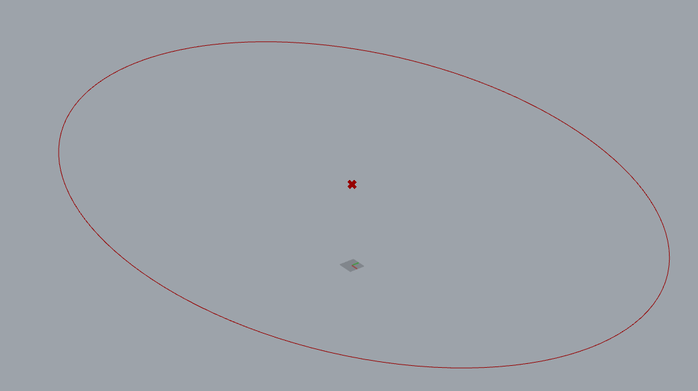

# A grasshopper version control and sharing tool (test_file.ghx)

## Summary:

_A **very** short explanation of what this does._

Makes a backpack for grasshopper binaries so that the backpack can be git version controlled alongside the gh binary. Also defines a pattern for documentation that goes along with it.

## Origin story:

_Why did this file come into being?_

For a very long time I've wanted a better way to version control grasshopper files, and to document them, and to share them. Might as well kill three birds with one stone! I first started thinking about this [13 years ago](https://www.grasshopper3d.com/forum/topics/version-control?id=2985220%3ATopic%3A831264) and now

## Detailed description:

_A much longer explanation of what this does._

This file does one pretty simple thing, it puts an elipse on a line. There's a a lot of boilerplate, relatively, as the model itself is pretty simple.

This will change in the long run though, as this process is refined. The idea is that thse panels will become a different UI, and the python nodes that do the traversal and canvas screenshot will be less imposing.

