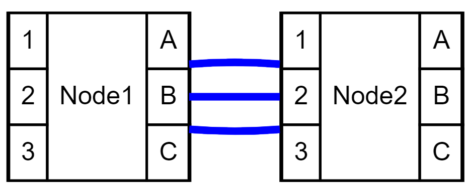
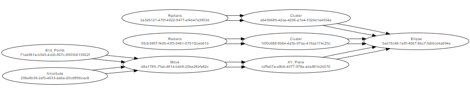
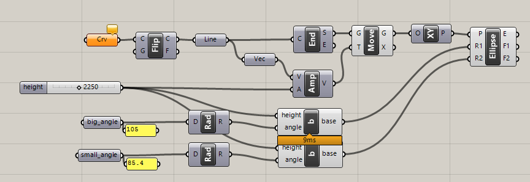

# Grasshopper Mirror — Spec

## Landscape: Existing Tools for Grasshopper Version Control & Documentation

The problem of version-controlling Grasshopper's binary `.gh` files has been recognised for over a decade ([forum thread from 2013](https://www.grasshopper3d.com/forum/topics/version-control?id=2985220%3ATopic%3A831264)). Several tools have taken a run at it, each with a different angle. Here's what exists and how Grasshopper Mirror relates.

### [GHShot](https://www.food4rhino.com/en/app/ghshot) — Design Versioning via Snapshots

- **Author:** Verina Cristie (PhD research project, MetaDesign Lab)
- **Approach:** Takes *snapshots* of your design progress and uploads them to a hosted server ([ghshot.metadesignlab.com](http://ghshot.metadesignlab.com/)). You can then view design history, download, share and review designs with collaborators online.
- **Rhino version:** Rhino 6 (Win & Mac). Released ~2019, 624 downloads. Proprietary license (free).
- **Strengths:** Full visual snapshots — you see actual geometry/state, not just topology. Collaboration features (share/review). Low barrier to entry (no git knowledge needed).
- **Weaknesses:** Requires an external server/account — the hosted service may or may not still be active. Proprietary and closed-source. Doesn't produce a diffable text artefact, so you can't use standard git tooling. Not a topology representation — you're comparing screenshots, not structure.
- **Comparison to Mirror:** GHShot captures *what it looks like*; Mirror captures *what it is* (graph structure). These are complementary — a good workflow might use both.

### [Githopper](https://www.food4rhino.com/en/app/githopper) — Git Interface Inside Grasshopper

- **Author:** Amir Hossein Oliaee. Open-source (MIT), [github.com/oliaee/Githopper](https://github.com/oliaee/Githopper).
- **Approach:** A set of GHPython components that wrap git commands (init, add, commit, push, pull, branch, merge, etc.) so you can drive git directly from the Grasshopper canvas. Written in Python, runs inside GH.
- **Rhino version:** Rhino 5 & 6. Released 2019, last updated Feb 2020. 474 downloads, 10 GitHub stars. MIT license.
- **Strengths:** Open-source. Brings git operations into the GH UI — no need to leave the canvas. Custom git commands can be added without modifying the plugin source. Beginner-friendly (simplifies complex git situations). Has a [tutorial video series](https://www.youtube.com/playlist?list=PLexAqzvLGzqF2broyyQi4fwY8e7gYZegs).
- **Weaknesses:** It version-controls the *binary `.gh` file itself* — so git stores opaque blobs. You get history, but no meaningful diffs. No topology extraction or text representation of the graph. Last updated 2020 (6 years ago), so likely doesn't support Rhino 7/8.
- **Comparison to Mirror:** Githopper solves *"how do I use git from GH?"* Mirror solves *"how do I make GH's content diffable?"* They address different halves of the same problem. An ideal workflow could use Mirror to produce the diffable `.dot` file and Githopper-style components to commit/push.

### [BranchHopper](https://www.food4rhino.com/en/app/branchhopper) — Visual Version Control Inside Grasshopper

- **Author:** Martin Manegold. Proprietary (free). [branchhopper.com](https://branchhopper.com).
- **Approach:** Adds *visual* version control directly inside Grasshopper. Git-based, supporting commits and versioning. Lets you track, manage and visualise changes to a Grasshopper definition from within the canvas.
- **Rhino version:** Rhino 7 & 8 (Win). Beta release (0.0.6.0-beta) from March 2025. 62 downloads so far. Proprietary.
- **Strengths:** The newest tool in the space — actively developed and targeting current Rhino versions. Visual change tracking inside GH (not just a CLI wrapper). Git-native, so it will support branches, merges, etc. Has a roadmap for further features.
- **Weaknesses:** Very early beta — only 62 downloads, no reviews yet. Proprietary/closed-source, so you can't inspect or extend it. Distributed as a `.yak` package (requires manual rename from `.zip`). It's not clear yet whether it produces any diffable text representation, or if it relies on its own visual diff UI.
- **Comparison to Mirror:** BranchHopper is the closest competitor in spirit — both want structured version control for GH. But BranchHopper is a closed-source product; Mirror produces an open, standard format (DOT/Graphviz) that works with any text diff tool. If BranchHopper's visual diff is good, it may be a better UX for casual users; Mirror's text output is better for CI/CD, code review, and integration with existing git workflows.

### [git_rhino_ghx](https://github.com/ail-and-colleagues/git_rhino_ghx) — GHX Diff & DOT Export

- **Author:** kkado (Chiba University / ail-and-colleagues). MIT license.
- **Approach:** Two Python scripts. `ghx_to_dot.py` parses `.ghx` (XML-format Grasshopper) files and produces a DOT graph. `ghx_diff.py` compares two branches and outputs a colour-coded `.ghx` file highlighting what changed (added/removed/modified components).
- **Rhino version:** Works on `.ghx` files externally (no GH plugin needed). 4 GitHub stars, last updated 2022.
- **Strengths:** The most similar tool to Mirror — also does topology→DOT. Works *outside* Grasshopper (parses the `.ghx` XML directly), which means it could run in CI. The diff output is a `.ghx` file you can open in GH to see changes visually (colour-coded). Can optionally include component hashes.
- **Weaknesses:** Only works with `.ghx` (XML) format, not the default binary `.gh`. The DOT output is simpler (no record-based structured nodes). Small project, limited documentation (partly in Japanese). No active development since 2022.
- **Comparison to Mirror:** Very aligned goals. The key difference is that Mirror works *inside* running Grasshopper (accessing the live SDK objects), while git_rhino_ghx parses the serialised `.ghx` XML. Mirror could learn from ghx_diff's approach of colour-coding changes. Working inside GH gives Mirror access to runtime values and nicknames, but requires GH to be open; parsing `.ghx` externally enables CI/automation.

### [compas-actions.ghpython_components](https://github.com/compas-dev/compas-actions.ghpython_components) — Componentizer (GitHub Action)

- **Author:** COMPAS / Gramazio Kohler Research (ETH Zurich). MIT license. 46 GitHub stars.
- **Approach:** A different angle — instead of version-controlling `.gh` files, you *write components as text files* (Python code + JSON metadata + icon) and use a GitHub Action to compile them into `.ghuser` components. This means the *source of truth is text*, making it naturally version-controllable.
- **Strengths:** Solves the root cause — if your components are text, you don't need to diff binaries. Full CI/CD pipeline via GitHub Actions. Supports IronPython (Rhino ≤7) and CPython (Rhino 8). Well-documented, actively maintained (5 releases, last Feb 2024).
- **Weaknesses:** Only covers *custom* GHPython components, not arbitrary GH definitions. You have to author components in a specific folder structure with metadata JSON. The compiled `.ghuser` files lose their identity once placed on a canvas (they become plain GHPython components, so updates don't propagate automatically). Not useful for visual programming workflows — this is a developer tool.
- **Comparison to Mirror:** Different problem space. compas-actions is for *building reusable components as code*; Mirror is for *documenting and diffing existing GH definitions*. They could complement each other: use compas-actions to build your custom nodes, and Mirror to document the definitions that use them.

### Summary Table

| Tool | Approach | Works inside GH? | Produces diffable text? | Open-source? | Active? |
|---|---|---|---|---|---|
| **Grasshopper Mirror** | Topology → DOT (Graphviz) | Yes (Python node) | Yes (.dot) | Yes | Yes (this repo) |
| **GHShot** | Visual snapshots → hosted server | Yes (plugin) | No | No | Unclear (2019) |
| **Githopper** | Git CLI wrapper as GH components | Yes (GHPython) | No (commits binary .gh) | Yes (MIT) | No (2020) |
| **BranchHopper** | Visual version control + Git | Yes (plugin) | Unknown | No | Yes (beta 2025) |
| **git_rhino_ghx** | Parse .ghx → DOT + colour diff | No (external scripts) | Yes (.dot) | Yes (MIT) | No (2022) |
| **compas-actions** | Text source → compile to .ghuser | No (GitHub Actions) | Yes (source is text) | Yes (MIT) | Yes (2024) |

### Where Grasshopper Mirror fits

Mirror occupies a unique position: it's the only tool that extracts structured, diffable topology from a *live* Grasshopper canvas into an open standard format (DOT). This means:

1. **Standard tooling** — DOT files can be diffed with `git diff`, rendered with Graphviz, displayed in VS Code, processed by any text tool
2. **No lock-in** — no hosted service, no proprietary format, no special viewer required
3. **Complementary** — it doesn't replace git workflows (Githopper) or visual snapshots (GHShot), it provides the missing "what changed structurally?" layer

---

## Design Decisions

Synthesised from an interview with the project creator (Ben Doherty, March 2026).

### Scope & Identity

- **Name:** "Grasshopper Mirror" is a working title. Naming is deferred — get the tool right first.
- **Packaging:** Start as a paste-in Python node to iterate on UX. Convert to a proper plugin (.gha/.yak) only once the experience is worth packaging. Don't make a plugin for the sake of it.
- **Target platform:** Rhino 8+ (CPython). No need to support Rhino 7 / IronPython 2.7.
- **Live canvas only.** No external `.ghx` parsing — the value is in accessing the live SDK objects (runtime values, nicknames, state). `.ghx` XML ordering isn't guaranteed, making external diffs unreliable.

### Output Format

- **HTML-table record nodes.** The final DOT output should use the `<table>` HTML label format with input ports on the left, component name in the centre, and output ports on the right — mirroring the visual structure of a GH node.
- **GUIDs:** Include in a non-visual element (e.g. DOT `comment` attribute or a `// guid: ...` comment) so they appear in text diffs but not in rendered graphs.
- **Stability is critical.** If nothing changes in the GH file, the DOT output must be byte-identical. Nodes and edges must be sorted deterministically (e.g. by GUID), not by enumeration order.
- **Format flexibility.** DOT is the current format, but Mermaid is also acceptable if it can handle the node complexity. A JSON/YAML sidecar with full topology data (nodes, edges, values, state) is worth adding — it's easier to parse programmatically and could feed the future aggregation website.
- **Groups:** GH canvas groups should be represented as DOT subgraphs.
- **Clusters:** Should be represented as an unconnected subgraph, with a name that is the same as the name of the cluster. The node in the main graph should look like other nodes.

### Data Capture — The 4-File Commit

A single "commit" produces (or updates) **four core files**, all committed together. The `.gh` file is the the source of truth, and the working file. The others are metadata that allows the file to be diffed. These files are:

| File | Contents | Diff behaviour |
|------|----------|----------------|
| `<name>.gh` | The Grasshopper binary | Opaque blob — git stores it, but can't diff it. This is the actual working file. |
| `<name>_topology.dot` | Graph structure: nodes, sockets, edges, groups | The primary diffable artefact. Structural changes are visible here. |
| `<name>_data.json` (future) | Leaf-node values, script source code, component state | Diffable. Shows what *values* changed between commits. |
| `<name>_layout.json` (future) | Component positions on the canvas | Diffable, but intentionally separate so canvas tidying doesn't pollute topology or data diffs. |

In addition, a commit may include changes to **docs** — updated text in the README, new or replaced screenshots in `docs/`.
[TODO: these docs need to be worked out so we can describe them here.]

**What goes into each layer:**

- **Topology** (`.dot`): nodes with input/output sockets, edges between sockets, GH groups as subgraph clusters. No values, no positions.
- **Data** (`.json`): leaf-node values captured at commit time via `repr()`, truncated to 100 chars for non-serialisable types. Component state (disabled/locked, preview on/off, data matching mode). Source code inside Python and C# script components.
- **Layout** (`.json`): x/y positions of each component on the canvas. Kept separate so layout-only changes are obvious and ignorable.
- **Docs** (`README.md` + `docs/`): screenshots of the Rhino viewport and the GH canvas, plus narrative documentation.

### Workflow & Trigger

- **Manual trigger.** The user explicitly triggers DOT generation (button press / trigger wire). This aligns with git's commit-on-demand philosophy.
- **Output:** For now, output a string to a panel (current behaviour). Auto-writing to disk is a natural next step but not the priority.
- **README auto-generation:** Mirror should auto-generate and update the `README.md` with YAML frontmatter and standard sections.
- **No git automation.** Mirror produces files; the user (or a separate tool) handles git. Don't take on git command maintenance.

### Folder Structure & Packaging

Mirror should include a **setup/scaffold function** that creates the standard folder structure:

```
<project_name>/
├── <project_name>.gh              # the binary GH file
├── <project_name>_topology.dot    # graph structure (primary diff target)
├── <project_name>_data.json       # values, state, script source (future)
├── <project_name>_layout.json     # canvas positions (future)
├── README.md                      # auto-generated, YAML frontmatter
└── docs/
    ├── canvas.png                 # screenshot of the GH canvas
    ├── viewport.png               # screenshot of the Rhino model/viewport
    └── ...                        # any other images referenced in README
```

All four core files plus any updated docs should be committed together as a single atomic commit.

**README frontmatter fields** (current set, kept as-is for now):

- `tiny_description`
- `repo_url`
- `tags`
- `authors` (name + github handle)
- `headline_image`

This metadata schema feeds the **long-term aggregation website** vision — a searchable catalogue of GH definitions. The spec should account for this (standardised, machine-readable metadata).

### Screenshot Workflow

The docs folder should stay up to date with screenshots of the Rhino viewport and the GH canvas. Ideally this uses **existing tools** rather than building screenshot capture into Mirror:

- **GH canvas screenshot:** Grasshopper has a built-in `File → Export Hi-Res Image` for the canvas. There are also plugins like [GHShot](https://www.food4rhino.com/en/app/ghshot) that automate this. Rhino 8's `GrasshopperDocument` API may also expose canvas capture programmatically.
- **Rhino viewport screenshot:** Rhino's `ViewCaptureToFile` command (or `rs.Command("_-ViewCaptureToFile")` from Python) can capture the active viewport to a PNG. This could be scripted as part of the commit workflow.
- **Workflow:** When the user triggers a Mirror commit, the tool could optionally invoke these capture commands and save the results to `docs/`. This keeps screenshots in sync with the topology snapshot without Mirror needing to implement its own rendering.
- **Future:** A "full commit" button that does: (1) generate topology DOT, (2) capture data + layout, (3) screenshot canvas + viewport to `docs/`, (4) update README — producing a complete, self-documenting commit-ready package.

### Diff & Comparison

- **External diffing only.** Rely on `git diff`, VS Code diff, and standard text tools. No custom diff/colour-coding in Mirror itself.
- **Human-readability:** The DOT output should be clean and formatted (easy to scan by eye), but not at the expense of completeness. Readable *and* complete.

### Distribution & Licensing

- **Licence:** Permissive but non-infectious and non-commercial-resale. This points toward something like [PolyForm Noncommercial](https://polyformproject.org/licenses/noncommercial/1.0.0/) or a dual MIT + Commons Clause arrangement. Needs further discussion — the key constraints are: (a) people can use it freely on commercial projects, (b) nobody can resell the tool itself.
- **Distribution:** Eventually food4rhino + yak package manager, but that's a long way off. Get the tool right first.
- **Governance:** Community project sponsored by BVN. Not an internal tool that happens to be open.
- **Primary audience:** Computational designers in Sydney (all companies), expanding to the broader GH community.

---

## Interview: Design Questions (Answered)

<details>
<summary>Click to expand the full Q&A</summary>

### Scope & Identity

| # | Question | Answer |
|---|----------|--------|
| 1 | Is "Grasshopper Mirror" the final name, or is this a working title? Any preferences? | Working title, don't want to think about names for now. |
| 2 | Should this be a standalone GH plugin (.gha/.yak), a Python node you paste in, or both? | Plugin eventually, but need to get the UX worked out first. Something worth converting, not a plugin for the sake of it. |
| 3 | What Rhino/GH versions do you want to target? Just Rhino 8 (CPython)? Or also Rhino 7 (IronPython 2.7)? | 8 onwards. |
| 4 | Should it also work on `.ghx` files externally (like git_rhino_ghx does), so it can run in CI without Grasshopper open? | Live canvas only is fine. GHX ordering isn't guaranteed, making external diffs unstable. |

### Output Format

| # | Question | Answer |
|---|----------|--------|
| 5 | Subgraph clusters or HTML-table record nodes for the final output? | HTML nodes — they represent input/output sockets on a GH node well. |
| 6 | Should the GUIDs appear in the DOT output? | Show in a non-visual element — visible in diffs but not in rendered graphs. |
| 7 | Should the DOT be "stable" (byte-identical if nothing changed)? | Yes, that's a key thing. |
| 8 | Beyond DOT, would you also want a JSON or YAML sidecar? | If important, sure. Not wedded to DOT — could be Mermaid, as long as node complexity is supported. |
| 9 | Should groups/clusters on the GH canvas be represented? | Yes. |

### Data Capture

| # | Question | Answer |
|---|----------|--------|
| 10 | Leaf-node values — runtime or persisted defaults? | Capture the value at point of commit (there will be a commit button). |
| 11 | Should it capture component state (disabled, preview, data matching)? | Yes. |
| 12 | Should it capture source code inside Python/C# script components? | Yes. |
| 13 | Should it capture component positions on the canvas? | Not in the DOT file. Considering separate files for position and data. |

### Workflow & Trigger

| # | Question | Answer |
|---|----------|--------|
| 14 | How should DOT generation be triggered? | Manually — fits git philosophy best. |
| 15 | Auto-write to disk or output to panel? | Output to panel for now. Auto-write is an easy add later. |
| 16 | Should it auto-generate/update the README.md? | Yes, auto update. |
| 17 | Should Mirror run git commands? | Leave git to the user / separate git interface. Don't want to maintain git integration. |

### Folder Structure & Packaging

| # | Question | Answer |
|---|----------|--------|
| 18 | YAML frontmatter fields — add or remove any? | Keep as-is for now. |
| 19 | Should Mirror scaffold the folder structure? | Yes, have a setup function. |
| 20 | Long-term aggregation website — still the plan? | Yes, that's what the metadata is for. |

### Diff & Comparison

| # | Question | Answer |
|---|----------|--------|
| 21 | Mirror's own diffing, or external tools? | External diffing is fine for now. |
| 22 | Colour-coded DOT showing changes? | No, standard git tools should handle it. |
| 23 | Human-readable vs machine-optimised DOT? | Clean and readable, but don't sacrifice completeness. |

### Distribution & Community

| # | Question | Answer |
|---|----------|--------|
| 24 | What licence? | Permissive, non-infectious, no reselling. People will use it on commercial projects. |
| 25 | Publish on food4rhino / yak? | Yes, eventually, but a long way off. |
| 26 | BVN internal tool or community project? | Community project that BVN sponsors. |
| 27 | Primary audience? | Computational designers in Sydney, all companies. |

</details>

---

## Original Spec: GH2DOT

I've started hacking on this, with a pretty copilot heavy process.

The ideal is that it'll give us something that we're able to keep with GH files that is able to be version controlled.

Here's the spec that I got copilot to prompt me for details:

---

It's a tool that inspects/reflects the graph of grasshopper components on the canvas.
It will output a dot file that captures the topology of the graph.
The graph nodes have multiple inputs and outputs, so it'll probably need a Record-based Node because where the edge is connected matters. But I'm open to other suggestions on how to construct each node. It may be a subgraph or cluster.

Ideally It'll be written in python and run in a python node in the graph, or be a C# component.

The dot file will be put into a folder with the .gh file. That folder will then be initialised as a git repo and pushed to github.

This version won't worry about the data that's passed through the nodes, but it might capture the values of input leaf-nodes if they're easily serialisable (e.g. numbers or strings). Values that aren't easily serialised should contain 100 chars or so of the python repr version of their data value.

The edges don't have any special values, other than the nodes that they connect.

Each node can have multiple input sockets and multiple output sockets.
Each output socket can have multiple edges coming out of it, and each Input socket can have multiple edges going into it.
However, a node can't be connected to itself, and any given pair of sockets can have 1 or 0 edges between them.

I'd prefer it to be python, as I'm more comfortable with that, as are more grasshopper users. However, there may be elements of the sdk that aren't accessible through python.

It should be packaged as a node, that is added to the canvas. The the configuration details are added to the input components of that node.

The github repo will have protection on the main branch, but have a very loose permissions structure on the branches.

The dot file will be called <filename>_topology.dot where filename is the name of the grasshopper file, without the .gh extension.

Each folder should also have a readme.md that has some details about the grasshoper file, and a docs folder that will contain images that are referenced into the readme file.

There are no performance concerns. Grasshopper graphs are relatively small. Less than 100 nodes usually.

> Yes, I think you have enough detail to start writing a prototype in Python! Here's a summary of your spec to guide you:

**Tool Description:**

- **Purpose:** Inspect and reflect the graph of Grasshopper components on the canvas.
- **Output:** Generates a dot file capturing the topology of the graph.

**Graph Structure:**

- **Nodes:**
  - Multiple input and output sockets.
  - Record-based nodes to capture where edges are connected.
  - No self-connections.
  - Each pair of sockets can have at most one edge between them.
- **Edges:**
  - No special values, only connect nodes.

**Implementation:**

- **Language:** Python.
- **Integration:** Packaged as a node added to the Grasshopper canvas. Configuration details are added to the input components of this node.

**Output Details:**

- **Dot File:**
  - Named `<filename>_topology.dot` where `<filename>` is the Grasshopper file name without the `.gh` extension.
  - Stored in the same folder as the `.gh` file.
- **Serialization:**
  - Capture values of input leaf-nodes if easily serializable (e.g., numbers, strings).
  - For non-serializable values, include up to 100 characters of the Python `repr` version of the data value.

**Git Integration:**

- **Repository Initialization:**
  - Initialize the folder as a git repository.
  - Push to GitHub.
  - Main branch protection with loose permissions on other branches.
- **Additional Files:**
  - `README.md` with details about the Grasshopper file.
  - `docs` folder containing images referenced in the `README.md`.

**Error Handling:**

- Throw standard Python errors or create an error node colored red.
- Maintain as much topology as possible.

**Configuration:**

- Handled through input components.

**Performance:**

- No significant concerns as Grasshopper graphs are typically small (less than 100 nodes).

The code in `main.py` starts work on making it a proper piece of software, and the code in `traverse.py` is starting to be able to reflect a grasshopper file from within.

## Example diagrams

This shows that graphviz can show a structured node that parallels a grasshopper node.



``` dot
graph mygraph {
  node [shape=record, fontsize=10, fontname=Arial];
  rankdir=LR;
  ranksep=0.5;
  rank=max;
  splines=true;
  overlap=false;
  mindist=0.2;

  node1 [shape=record, margin=0, label=<
    <table border="0" cellborder="1" cellspacing="0" cellpadding="4">
      <tr><td port="1">1</td><td rowspan="3">Node1</td><td port="A">A</td></tr>
      <tr><td port="2">2</td><td port="B">B</td></tr>
      <tr><td port="3">3</td><td port="C">C</td></tr>
    </table>>];

  node2 [shape=record, margin=0, label=<
    <table border="0" cellborder="1" cellspacing="0" cellpadding="4">
      <tr><td port="1">1</td><td rowspan="3">Node2</td><td port="A">A</td></tr>
      <tr><td port="2">2</td><td port="B">B</td></tr>
      <tr><td port="3">3</td><td port="C">C</td></tr>
    </table>>];
    

  node1:A -> node2:1 [color=blue, penwidth=3, tooltip="node1:A -- node2:1", URL="#"];
  node1:B -> node2:2 [color=blue, penwidth=3, tooltip="node1:B -- node2:2", URL="#"];
  node1:C -> node2:3 [color=blue, penwidth=3, tooltip="node1:C -- node2:3", URL="#"];
}
```



``` dot
digraph G {
    node [shape = record; fontsize = 10; fontname = Arial;];
    edge [arrowsize = 0.5;];
    rankdir = LR;
    
    "Python\ne77fdaee-d2b4-4f80-833d-ed08b2b3788c" [margin = 0;label = <
        <table border="0" cellborder="1" cellspacing="0" cellpadding="4">
        <tr><td port="Xin">X</td><td rowspan="3">Python</td> <td port="OUTout">out</td></tr>
        <tr><td port="Yin">Y</td>                            <td port="NODESout">nodes</td></tr>
        <tr><td port=""></td>                                <td port="EDGESout">edges</td></tr>
        </table>>;];
    
    "Amp\n296e8b38-2af3-4633-aa6e-20cd8f0bcac8" [margin = 0;label = <
        <table border="0" cellborder="1" cellspacing="0" cellpadding="4">
        <tr><td port="Vin">V</td> <td rowspan="2">Amp</td> <td port="Vout">V</td></tr>
        <tr><td port="Ain">A</td>                                                </tr>
        </table>>;];
    
    "Amp\n296e8b38-2af3-4633-aa6e-20cd8f0bcac8":Vout -> "Python\ne77fdaee-d2b4-4f80-833d-ed08b2b3788c":Xin;
}
```

And this example shows that we're actually able to parse a grasshopper file for the topology.

``` dot
digraph G {
    node [fontsize=10, fontname=Arial];
    rankdir=LR;
    ranksep=0.5;
    rank=max;
    splines=true;
    overlap=false;
    mindist=0.2;
    "XY_Plane\ncdffa07a-a8b6-4077-978a-eda881b24570" -> "Ellipse\n5ad19c48-1e9f-4067-8bc7-fa66cd4a694e"
    "Cluster\na6456689-42ae-4206-a7a4-5324d1a4934a" -> "Ellipse\n5ad19c48-1e9f-4067-8bc7-fa66cd4a694e"
    "Cluster\n10f0c688-9b64-4a5b-97aa-419aa174c25c" -> "Ellipse\n5ad19c48-1e9f-4067-8bc7-fa66cd4a694e"
    "Radians\n59cb3897-f400-43f3-9461-0701f2ceb61b" -> "Cluster\n10f0c688-9b64-4a5b-97aa-419aa174c25c"
    "Radians\n2a326121-470f-4022-9477-ef4b47e3853d" -> "Cluster\na6456689-42ae-4206-a7a4-5324d1a4934a"
    "Move\nd8a179fc-7fab-4814-b4b9-20be26bfe82c" -> "XY_Plane\ncdffa07a-a8b6-4077-978a-eda881b24570"
    "XY_Plane\ncdffa07a-a8b6-4077-978a-eda881b24570" -> "Ellipse\n5ad19c48-1e9f-4067-8bc7-fa66cd4a694e"
    "End_Points\n71ee981e-b545-4cb0-907c-8955b015922f" -> "Move\nd8a179fc-7fab-4814-b4b9-20be26bfe82c"
    "Amplitude\n296e8b38-2af3-4633-aa6e-20cd8f0bcac8" -> "Move\nd8a179fc-7fab-4814-b4b9-20be26bfe82c"
    "Move\nd8a179fc-7fab-4814-b4b9-20be26bfe82c" -> "XY_Plane\ncdffa07a-a8b6-4077-978a-eda881b24570"
    "End_Points\n71ee981e-b545-4cb0-907c-8955b015922f" -> "Move\nd8a179fc-7fab-4814-b4b9-20be26bfe82c"
    "Amplitude\n296e8b38-2af3-4633-aa6e-20cd8f0bcac8" -> "Move\nd8a179fc-7fab-4814-b4b9-20be26bfe82c"
    "Radians\n59cb3897-f400-43f3-9461-0701f2ceb61b" -> "Cluster\n10f0c688-9b64-4a5b-97aa-419aa174c25c"
    "Cluster\n10f0c688-9b64-4a5b-97aa-419aa174c25c" -> "Ellipse\n5ad19c48-1e9f-4067-8bc7-fa66cd4a694e"
    "Radians\n2a326121-470f-4022-9477-ef4b47e3853d" -> "Cluster\na6456689-42ae-4206-a7a4-5324d1a4934a"
    "Cluster\na6456689-42ae-4206-a7a4-5324d1a4934a" -> "Ellipse\n5ad19c48-1e9f-4067-8bc7-fa66cd4a694e"
}
```







It leaves out a lot of nodes, and it could definitely be clearer (i.e. hiding the node uid, and just showing the name, and also parsing it into records that look like the gh node.)

BUT IT'S A START

Please, pick this up and hack some more
.

---
